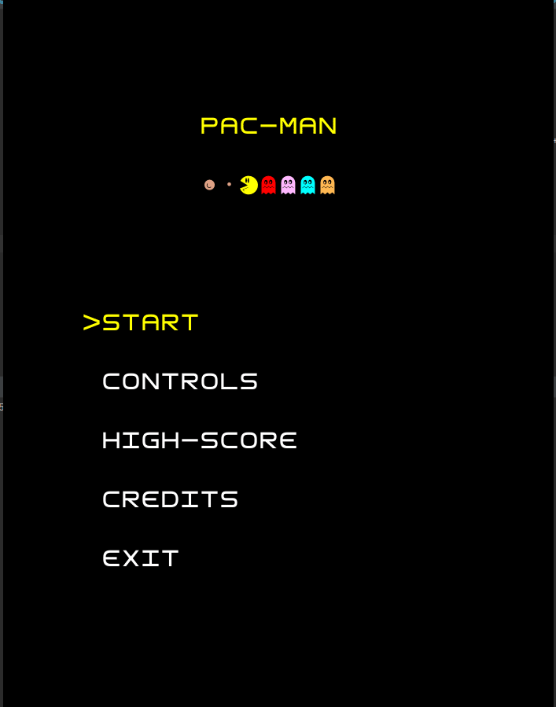

## PacMan

A clone of the classic PacMan game played in the arcade machines of the good old days, spiced up with some easter eggs related to the package manager of your favorite Linux distro.

  

Developed by Bruno Mendes (up201906166@fe.up.pt), Fernando Rego (up201905951@fe.up.pt) and Nuno Costa(up201906272@fe.up.pt).

## Implemented Features

- Map Loader from a file
    - Loads a map from a file in order to increase compatibility, making it possible to load different pacman maps, as long as it sticks to the defined structure
- Game Map Display
    - Custom font for a more precise replica of the original game elements
    - Usage of bitmasks for different Wall generation
- PacMan movement with the keyboard
- Ghost movement and states
- Different ghost strategies
    - Usage of the A-Star algorithm for a more precise path-finding solution
- Scoring and abilities with collectables
    - Usage of streams to recognize end-of-game status (no more PacDots)
- Keeping track of the highest score
- Increasing difficulty per level
- Application menus
    - Defeat screen (endless game, no winning screen)
    - In-game pause state
    - Animated level transition
- Sound effects
- Package manager easter eggs
    - Manjaro fruit
