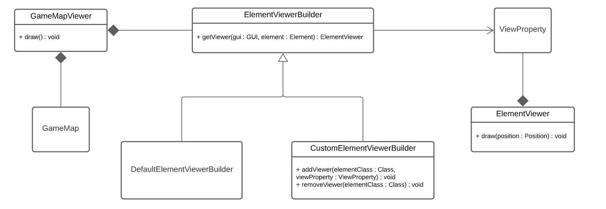
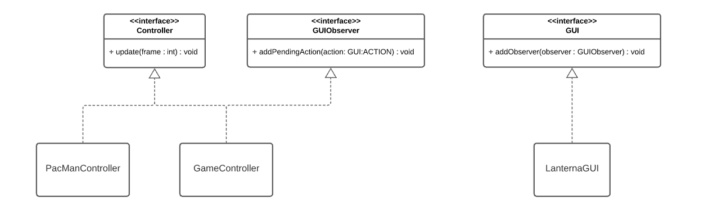
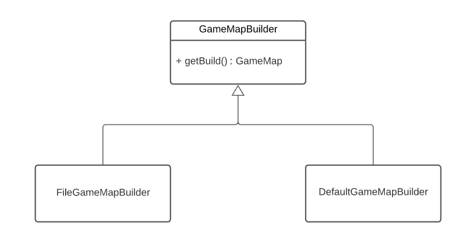

# Intermediate Report

## sudo PacMan

A clone of the classic PacMan game played in the arcade machines of the good old days, spiced up with some easter eggs related to the package manager of your favorite Linux distro.

  

## Current development state
Implemented:
- Map loader from a file
- Game map view
- PacMan movement with the keyboard
- PacDot collections

To be implemented:
- Ghost movement and states
- Scoring and abilities with collectables
- Win/defeat scenarios
- Level transitions
- Application menus
- Package manager easter eggs

## Architectural Design

  

The architectural design followed in this project was the MVC (particularly the definition represented above).
Each of its components is briefly described below.

### Model
Contains the entities that exist semantically in the game: the pacman, the ghosts, the map and its elements.

### View
Responsible for drawing the game elements (and, later, the menus) in a way that makes sense considering the model and is suited for any terminal-based view framework (in our case, Lanterna).

### Controller
Responsible for the flow of the application:
- Updates the screen at a given frame rate
- Updates the game state based on the input received from the GUI
- Switches between game menus based on game rules logic and user input (later)

## Testing

### Coverage/Mutations

  

### Particular test highlights
- ElementViewFactory: provided this class’ methods require knowledge from other classes (namely, the ViewProperty and the GUI), stubs were used to ensure the correct decouple of the tests, and dummy parameters were injected where needed (namely, to create a model entity to be drawn).
- GameMapTest: a smoke test was executed on a smaller test map to ensure that the main map load features were working properly.

## Design Problems and solutions (UML)

### Multiple views
Each game element shall be drawn on the screen with the appropriate character and color. While it isn’t feasible to include this data in the model (should we ever switch to a 3D-based viewer framework, that would be highly uncomfortable), it is also lazy to create a different viewer class for each element just to hold different data, and act exactly the same way. To solve this issue, we opted to let a builder create the correct element viewer instance given the class of the given drawable element.

  

### Polling from the GUI
As seen in the classes, we could poll the input receiver (in our case, the GUI) for the last user action each frame and act upon it. However, with this approach we would lose some precision and possibly some key inputs. We found that the Lanterna framework provides methods for handling interrupts from the keyboard, and used this mechanism to inform any generic GUI observer of an action in “real time”. In our case, the game controller is the observer, acting upon the inputs to move the pacman.

  

### Game Map Builder
To avoid long lines of hard coded insertions in the game map class, it makes sense to have a separate class to do this job in a generic way (read from a file) and return the assembled GameMap object.

  

