# Final Delivery

## PacMan

A clone of the classic PacMan game played in the arcade machines of the good old days, spiced up with some easter eggs related to the package manager of your favorite Linux distro.

  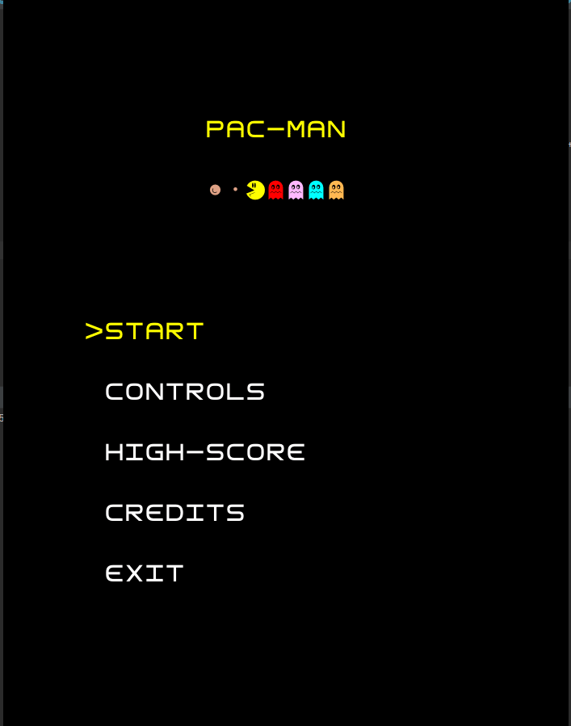

Developed by Bruno Mendes (up201906166@fe.up.pt), Fernando Rego (up201905951@fe.up.pt) and Nuno Costa(up201906272@fe.up.pt).

## Implemented Features

- Map Loader from a file 
    - Loads a map from a file in order to increase compatibility, making it possible to load different pacman maps, as long as it sticks to the defined structure
- Game Map Display
    - Custom font for a more precise replica of the original game elements
    - Usage of bitmasks for different Wall generation
- PacMan movement with the keyboard
- Ghost movement and states
- Different ghost strategies
  - Usage of the A-Star algorithm for a more precise path-finding solution
- Scoring and abilities with collectables
  - Usage of streams to recognize end-of-game status (no more PacDots)
- Keeping track of the highest score
- Increasing difficulty per level 
- Application menus
  - Defeat screen (endless game, no winning screen)
  - In-game pause state  
  - Animated level transition
- Sound effects
- Package manager easter eggs
  - Manjaro fruit

## Architectural Design

  

The architectural design followed in this project was the MVC (particularly the definition represented above).
Each of its components is briefly described below.

### Model
Contains the entities that exist semantically in the game: the pacman, the ghosts, the map and its elements. It also contains the status of certain elements (the pacman, for example), which are to be updated and changed by the controller.

### View

Responsible for drawing the game elements (and the menus) in a way that makes sense considering the model. Is suited for any terminal-based view framework (in our case, Lanterna).

### Controller
Responsible for the flow of the application:
- Updates the screen at a given frame rate
- Updates the game state based on the input received from the GUI
- Switches between game menus according to either in-game logic or user input
- Defines the game-flow

## Design Problems

#### Viewer builder
###### Problem in context
In our terminal-based graphical user interface, each game map element is represented by a single character, which removes the need for a compositor-like Sprite class. In spite of this, the aspect of some elements depends on their state: the ghosts must alternate between dead, frightened and regular (chase/scatter) modes, and the PacMan should point to the right direction, giving the user a visual hint of his orientation.
Doing these kinds of checks in the GameMapViewer draw() method would make things cumbersome and not easily scalable.

###### The pattern
To go around this issue, we created a builder class for generic map elements, which do not hold a state, and builders for the elements that do. The GameMapViewer draw() method is responsible for calling the appropriate builder.

###### Implementation

  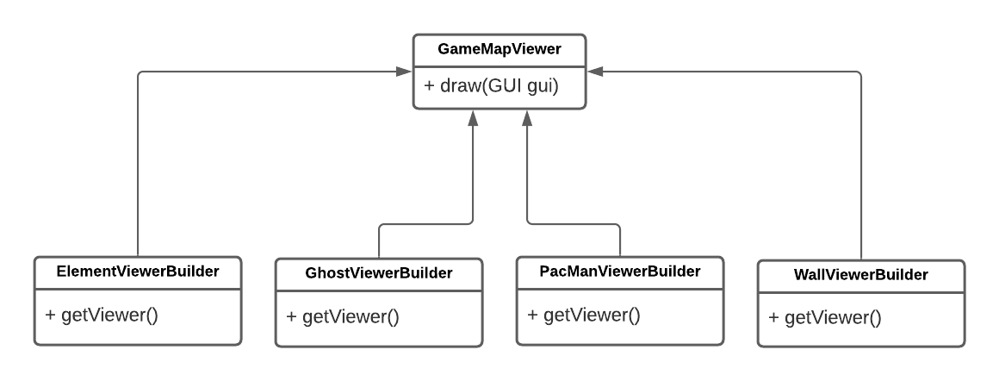

[GameMapViewer](https://github.com/FEUP-LPOO-2021/lpoo-2021-g50/blob/c3121d3b31d1fb2c9c448e99c8bbff370a5b2a62/src/main/java/com/g50/view/GameMapViewer.java#L28-L46)

[ElementViewerBuilder](https://github.com/FEUP-LPOO-2021/lpoo-2021-g50/blob/c3121d3b31d1fb2c9c448e99c8bbff370a5b2a62/src/main/java/com/g50/view/builders/ElementViewerBuilder.java#L19-L28)

[GhostViewerBuilder](https://github.com/FEUP-LPOO-2021/lpoo-2021-g50/blob/c3121d3b31d1fb2c9c448e99c8bbff370a5b2a62/src/main/java/com/g50/view/builders/GhostViewerBuilder.java#L22-L37)

[PacManViewerBuilder](https://github.com/FEUP-LPOO-2021/lpoo-2021-g50/blob/c3121d3b31d1fb2c9c448e99c8bbff370a5b2a62/src/main/java/com/g50/view/builders/PacManViewerBuilder.java#L20-L29)

[WallViewerBuilder](https://github.com/FEUP-LPOO-2021/lpoo-2021-g50/blob/c3121d3b31d1fb2c9c448e99c8bbff370a5b2a62/src/main/java/com/g50/view/builders/WallViewerBuilder.java#L20-L29)

###### Consequences
This approach did allow to modularize the code and hide complicated implementation details (such as getting the wall character based on its surroundings), but could be improved by making the ElementViewerBuilder class a factory calling the appropriate builder, which would reduce the draw() method complexity even further.

#### GUI Observers

###### Problem in context
Fetching actions from the GUI (in our case, only the keyboard input, but same could be said for mouse input), as seen in the classes, involved polling in a not so pretty busy wait game loop. To add to this issue, several calls were made to the kernel to fetch the time to determine whether to draw a new frame or not.

###### The pattern
The GUI is responsible for informing all interested observers when it is time to update the game state and draw a new frame. In the game, the Application class adds itself to the list of GUI observers and delegates responsability to the appropriate controller, each frame, to update the game state and refresh the screen.

###### Implementation

  

###### Consequences
An interrupt-like solution involved, as expected, some extra complexity and the possible raise of concurrency issues, but we found the extra precision given by the timer and the aspect of the code to compensate these concerns.

#### Ghost strategies

###### Problem in context
The ghost behaviour in the classic PacMan game is a surpringly difficult matter. When scattered (walking around a fixed point), frightened (after the PacMan consumes a PacDot), dead (returning the cage after getting eaten), or in-cage, all ghosts behave similarly, but in chase mode, each of the little ones has a different personality.
Blinky follows the PacMan directly in the shortest path available, Inky tries to corner the PacMan knowing Blinky's position, Pinky tries to go in front of the PacMan (targeting 4 tiles above his position) and Clyde tries to keep a fair distance (8 tiles) from PacMan, not too close, not too far.

###### The pattern
The next step for a ghost is determined by its strategy. The strategy is responsible to calculate a new target and set the ghost orientation based on it, and is called by the controller when it's time to update the ghosts positions.

###### Implementation

  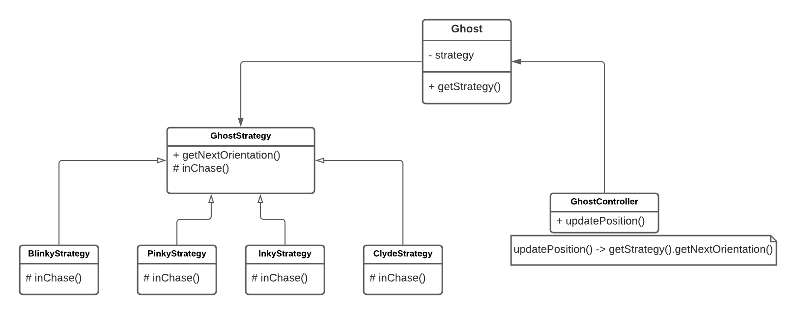

- [Ghost](https://github.com/FEUP-LPOO-2021/lpoo-2021-g50/blob/fe389c5baf728187495f94d4bcc764819abba61c/src/main/java/com/g50/model/element/movable/ghost/Ghost.java)
- [GhostController](https://github.com/FEUP-LPOO-2021/lpoo-2021-g50/blob/fe389c5baf728187495f94d4bcc764819abba61c/src/main/java/com/g50/controller/GhostController.java)
- [GhostStrategy](https://github.com/FEUP-LPOO-2021/lpoo-2021-g50/blob/fe389c5baf728187495f94d4bcc764819abba61c/src/main/java/com/g50/model/element/movable/ghost/strategy/GhostStrategy.java)
- [BlinkyStrategy](https://github.com/FEUP-LPOO-2021/lpoo-2021-g50/blob/fe389c5baf728187495f94d4bcc764819abba61c/src/main/java/com/g50/model/element/movable/ghost/strategy/BlinkyStrategy.java)
- [PinkyStrategy](https://github.com/FEUP-LPOO-2021/lpoo-2021-g50/blob/fe389c5baf728187495f94d4bcc764819abba61c/src/main/java/com/g50/model/element/movable/ghost/strategy/PinkyStrategy.java)
- [InkyStrategy](https://github.com/FEUP-LPOO-2021/lpoo-2021-g50/blob/fe389c5baf728187495f94d4bcc764819abba61c/src/main/java/com/g50/model/element/movable/ghost/strategy/InkyStrategy.java)
- [ClydeStrategy](https://github.com/FEUP-LPOO-2021/lpoo-2021-g50/blob/fe389c5baf728187495f94d4bcc764819abba61c/src/main/java/com/g50/model/element/movable/ghost/strategy/ClydeStrategy.java)

###### Consequences
This approach allows ghosts to have any kind of personality, hiding the details from the controller, and presents no concerns.

#### Lanterna Framework Facade

###### Problem in context
It is desired that the game is correctly displayed on any terminal-based UI capable of loading a square font.

###### The pattern
The GUI interface presents the user all important terminal methods, not depending on any particular framework. The LanternaGUI class implements the above interface, using the Lanterna Terminal Graphics framework in a way that's easily understandable and flexible to the view programmer, who does not need to worry about lower level Lanterna calls.

###### Implementation

  

###### Consequences
This approach simplifies the viewer code and presents no concerns.

#### Game Map Viewer Decorator

###### Problem in context
Besides drawing the main game board, the game must present the player some more information regarding the current score, the all time high score, the remaining lives and the current game level.

###### The pattern
A game viewer class contains a board viewer and displays the extra information on top of it, effectively decorating the basic viewer in a semantic way.

###### Implementation

  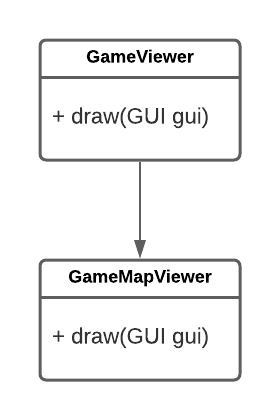

###### Consequences
This approach has the potential to expand the game functionality: if we ever need to include a back button or a settings wheel icon, only a new "view port" decorating the existing ones would be necessary. This, however, is not a solution for all kinds of problems: as of now, there is no easy way for decoupling the map position from the terminal screen position, which would require an intervention in all viewer classes.

#### Controller composites

###### Problem in context
It is not desirable that a "god" controller exists, and neither that a controller needs to intervene in models that don't belong to it.

###### The pattern
The compositions in the model are reflected in the controller: for example, the game controller holds the pacman controller and the four ghosts controllers.

###### Implementation

  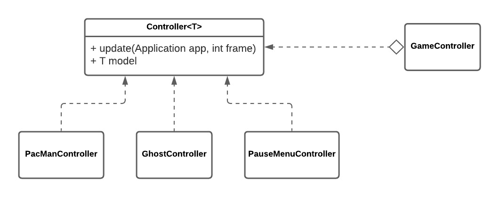

###### Consequences
In a classic compositor pattern, the ability to add new parts is required. In our implementation, considering the restrictions of the game, only the pacman and the four ghosts are added, by the constructor. In a more generic fashion, more ghosts controllers could be added on the spot.

## Known Code Smells and Refactoring Suggestions

### Data Class

> A data class refers to a class that contains only fields and crude methods for accessing them (getters and setters). These are simply containers for data used by other classes. These classes don’t contain any additional functionality and can’t independently operate on the data that they own.

The Level class in the model is a data class because it contains only getters for the information at each level. This is a problem because classes are much more than just a "data bag" abstraction and we are using the class without any use of operations or transformations on that data.

A way to improve this problem is creating a text file with all the information of the levels and the program will read it from the file.

### Switch Statements

> A Switch Statement code smell refers to a complex switch operator or sequence of if statements.

In the Application class in the model, there is a large switch case that is used to get different data dependent on each state of the application. This can be a problem because when a new condition is added, we have to find and modify the switch case.

This can be refactored using the state pattern and, consequently, it would no longer be necessary for the controllers to change the state of the application and the switch case itself ceases to exist.

### Message Chains

> In code you see a series of calls resembling $a->b()->c()->d()

In our program there is a chain that receives input from the keyboard in the gui and then that input is passed in a chain, from the gui to the controllers of the various objects of the program. This may imply having to make changes to all relationships if there is any change at the bottom of the chain.

This problem can be solved if all the controllers add themselves to the observers of the gui, and thus, the gui passed the input directly to each of the controllers.

## Testing

### Coverage/Mutations

  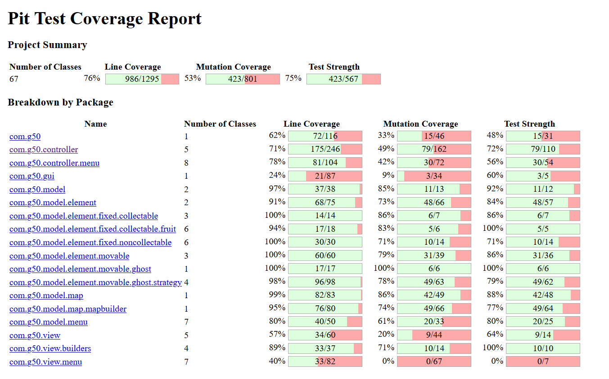

## Highlighted Features

### Walls and Bitmask

In the construction of the map, specifically of the walls of the map, instead of drawing a whole square for each one, we created 2 ^ 4 characters that correspond to all possibilities for each wall, with each side of the character corresponding to 1 bit of 4 sides. 

  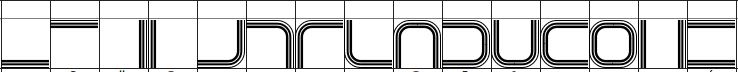
   
  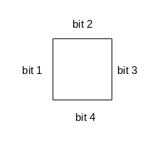

Thus, each wall was generated taking into account the elements in the adjacent positions (up, down, left, right) setting the bit corresponding to 1 if a wall is needed on that side of the character. The final result of the map was:

  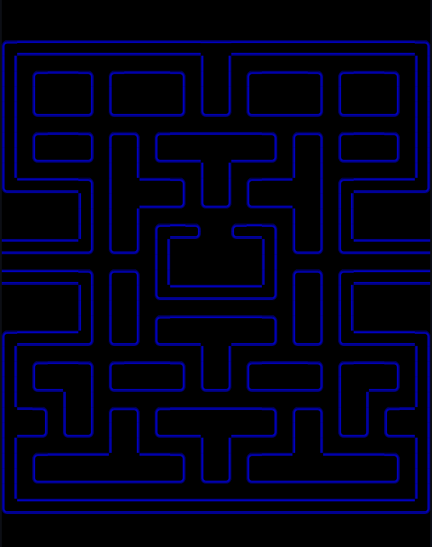

### Ghosts Personality

As stated in the design problems, each ghost behaves differently. For Blinky, we use a grid-based optimized A-Star algorithm to calculate the best shortest path to the PacMan.

  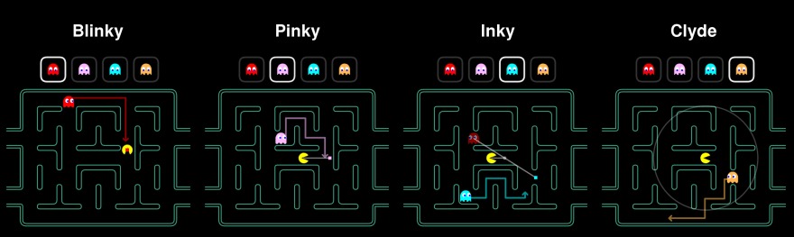

### Transition Between Levels

For the transition between levels, a small animation was created as in the original game with the pacman and one of the ghosts. The final result of the animation was:

  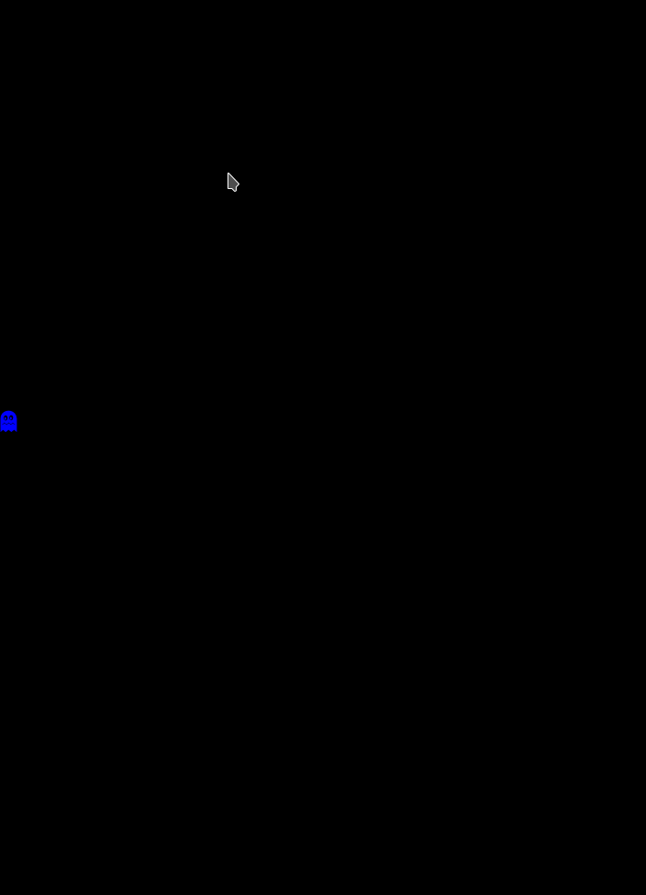

### Sound Effects

We added some of the original sound effects to our program, namely into the following situations:
- eating ghost
- eating power pellet
- pacman dies
- moving pacman
- "ready to start" jingle

Note: on some Linux machines we observed reliability problems, possibly due to the different file encoding audio formats or concurrency issues opening the same audio line.

## Self-Evaluation

Bruno Mendes: 33%

Fernando Rego: 33%

Nuno Costa: 33%

